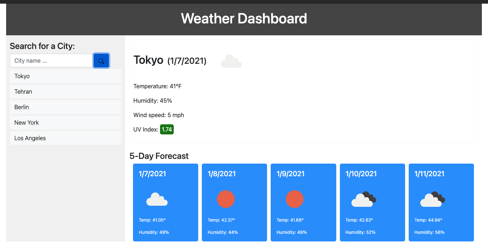

# Weather Dashboard

## Table of Contents
* [Project Summary](##project-summary)
* [Technologies Used](##technologies-used)
* [Example Code](##example-code)
* [How to Access](##how-to-access)
* [About Me](##about-me)
* [Screenshots](##screenshots)
---

## Project Summary
This is a weather dashboard that queries the OpenWeather API to return weather data for the current day and provide a 5-day forecast.

## Technologies Used
* [JavaScript](https://developer.mozilla.org/en-US/docs/Web/JavaScript)
* [JQuery](https://jquery.com/)
* [HTML5](https://developer.mozilla.org/en-US/docs/Web/Guide/HTML/HTML5)
* [CSS3](https://developer.mozilla.org/en-US/docs/Archive/CSS3)

## Example Code
Query OpenWeather API and store data in variable.
```
function currentWeather() {
    return $.ajax({
        url: "https://api.openweathermap.org/data/2.5/weather?q=" + cityName + "&units=imperial&appid=" + APIKey,
        method: "GET",
        cors: true,
        success: function(data) {
            var weatherSTR = JSON.stringify(data);
            weatherData = JSON.parse(weatherSTR);
        }
    })
}
```
Populate the page with data from the API.
```
function populateCurrent() {
    $("#current-weather").empty();
    $("#current-weather").append(`
        <h2><span id="city">${weatherData.name}</span><span id="date">(${dayjs.unix(weatherData.dt).format("M/D/YYYY")})</span><span id="weather-icon"></span></h2>
        <p id="temp">${"Temperature: " + Math.floor(weatherData.main.temp) + "\u00B0F"}</p>
        <p id="humid">${"Humidity: " + weatherData.main.humidity + "%"}</p>
        <p id="wind">${"Wind speed: " + Math.floor(weatherData.wind.speed) + " mph"}</p>
        <p><span id="uv"></span><span id="uv-num"></span></p>
    `)
    $("#weather-icon").append(`
        
    `)
}
```
Execute the API query when search button is clicked.
```
$("#submit").on("click", function(event) {
    event.preventDefault();

    // Get city name from input and execute save functions.
    cityName = $("#city-name").val();
    saveSearch();
    createButton();

    currentWeather().then(forecastWeather).then(uvIndex).then(function() {
        console.log("Weather Data " + cityName);
        console.log(weatherData);
        console.log("--------------");
        console.log("Forecast Data " + cityName);
        console.log(forecastData);
        console.log("--------------");
        console.log("UV Index Data " + cityName);
        console.log(uvindexData);
        populateCurrent();
        populateForecast();
        populateUVI();
    })
});
```


## How to Access
[Weather Dashboard](https://profjjk.github.io/weather-dashboard/)

## About Me
* [LinkedIn](www.linkedin.com/in/the-real-jordan-kelly)
* [GitHub](https://github.com/profjjk)

## Screenshots
